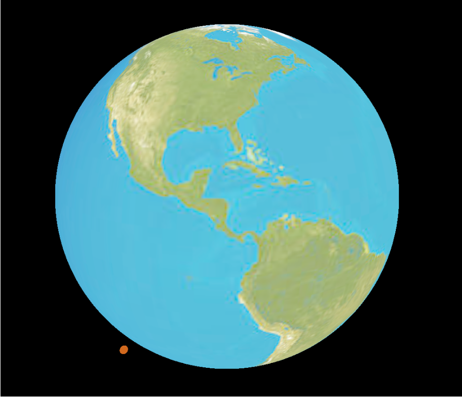

# Earth with Satellites

This is a small project to practice Node.js skills. It combines Node.js, Three.js, and WebSockets to create an interactive visualization of Earth and the satellites orbiting around it.

## Overview

The project consists of two main components:

1. **Frontend**: The frontend is built using the Three.js library, which provides a powerful and flexible way to render 3D graphics in the browser. It displays a realistic representation of Earth and the satellites in orbit.

2. **Backend**: The backend is implemented using Node.js and Express.js. It serves as the server-side component, handling WebSocket connections and sending real-time updates about the positions of the satellites to the frontend.



## Installation

To run the "Earth with Satellites" project locally, follow these steps:

1. Clone the repository:

   ```
   git clone https://github.com/kornatskyi/earth_with_satellites.git
   ```

2. Navigate to the project directory:

   ```
   cd earth_with_satellites
   ```

3. Install the dependencies for both the frontend and backend:

   ```
   cd client
   npm install
   cd ../server
   npm install
   ```

4. Start the backend server:

   ```
   cd server
   npm run dev
   ```

5. Open a new terminal window and start the frontend development server:

   ```
   cd client
   npm start
   ```

6. Open your web browser and visit `http://localhost:3000` to see the Earth with satellites in action!

## Technologies Used

- Node.js
- Express.js
- Three.js
- WebSockets

---
